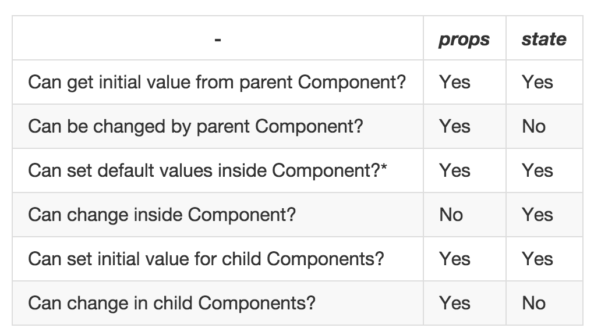

## Props

- What are props?
  - props (short for properties) are a Component's configuration, or its options.
    - They are received from above and immutable as far as the Component receiving them is concerned.
- What's the exact difference between props and state?
  - Props Vs State
  - State
    - The state starts with a default value when a Component mounts and then suffers from mutations in time (mostly generated from user events). It's representation of one point in time.
    - A Component manages its own state internally, but besides setting an initial state, has no business fiddling with the state of its children.
    - You could say the state is private.
    - Props
      - A Component cannot change its props, but it is responsible for putting together the props of its child Components.
  - They both have abstract terms and their values look the same, but they also have very different roles.
  - The main responsibility of a Component is to translate raw data into rich HTML. With that in mind, the props and the state together constitute the raw data that the HTML output derives from.
  - You could say props + state is the input data for the render() function of a Component, so we need to zoom in and see what each data type represents and where does it come from.
- Commonalities
  - Both props and state are plain JS objects
  - Both props and state changes trigger a render update
  - Both props and state are deterministic. If your Component generates different outputs for the same combination of props and state then you're doing something wrong.
- Does this go inside props or state?
  - If a Component needs to alter one of its attributes at some point in time, that attribute should be part of its state, otherwise it should just be a prop for that Component.

Should this Component have state?

  - state is optional.
  - Since state increases complexity and reduces predictability, a Component without state is preferable.
  - Even though you clearly can't do without state in an interactive app, you should avoid having too many Stateful Components.

- Stateless Component
  - Only props, no state. There's not much going on besides the render() function and all their logic revolves around the props they receive. This makes them very easy to follow (and test for that matter).
  - We sometimes call these `dumb-as-fuck` Components (which turns out to be the only way to misuse the F-word in the English language).
- Stateful Component
  — Both props and state. We also call these state managers. They are in charge of client-server communication (XHR, web sockets, etc.), processing data and responding to user events.
  - These sort of logistics should be encapsulated in a moderate number of Stateful Components, while all visualization and formatting logic should move downstream into as many Stateless Components as possible.
