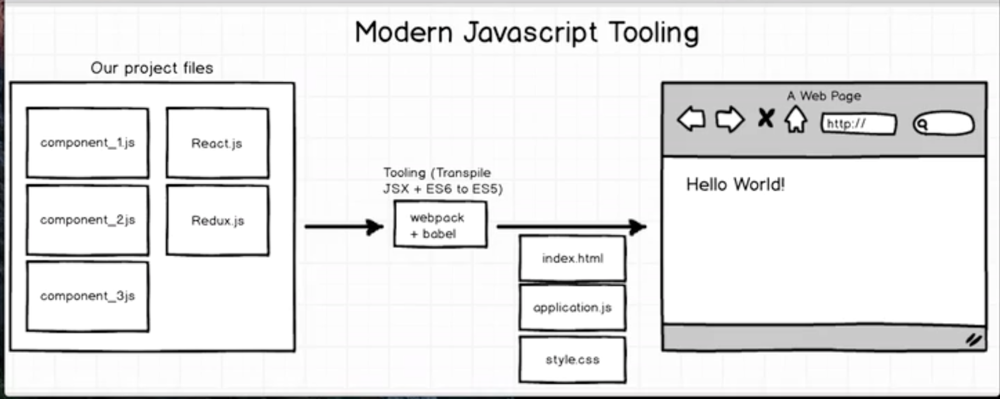

# Intro to React.JS

## What is it?
  - Open-source JavaScript library
  - provides a view for data rendered as HTML.
  - Typically rendered using components that contain additional components
  - 9th most starred project of all time on GitHub

## Notable features

#### One-way data flow
  - Properties are passed to a component's render function as properties in its HTML tag.
  - A component cannot directly modify any properties passed to it, but can be passed callback functions that do modify values.
  - "Properties flow down and actions flow up".

#### Virtual DOM
  - In-memory data structure cache created by React.
  - Computes the resulting differences, and then updates the browser's displayed DOM efficiently.
  - For example, a shopping cart component would be written to render the entire shopping cart on any data change. If a product line subcomponent had no changes to the properties, a cached rendering would be used instead of re-rendering.

#### JSX
  - JS extension syntax allowing easy quoting of HTML and using HTML tag syntax to render subcomponents.
  - React components are typically written in JSX.
  - HTML syntax is turned into JavaScript calls of the React library. You may also write pure JS.

